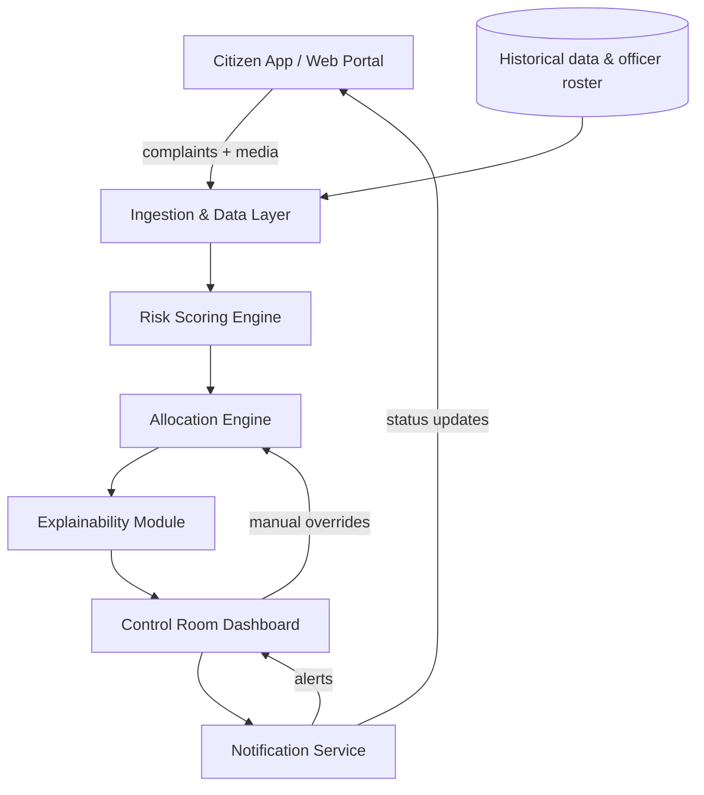

# Traffic Risk Heatmap & Police Deployment Decision Support System

**AI-driven platform for Nagpur City that scores traffic risk across the city in real time and recommends where police officers should be deployed — with every recommendation explainable and manually overridable.**

 

*Prepared for: Nagpur City Traffic Police / Smart City Control Room*

---

## Table of Contents

- [Overview](#overview)
- [Problem Statement](#problem-statement)
- [Goals](#goals)
- [Key Features](#key-features)
- [Scope](#scope)
- [System Architecture](#system-architecture)
- [Tech Stack](#tech-stack)
- [Success Metrics](#success-metrics)
- [Roadmap](#roadmap)
- [Getting Started](#getting-started)
- [Repository Structure](#repository-structure)
- [Full Requirements and Design Detail](#full-requirements-and-design-detail)
- [Contributing](#contributing)
- [License](#license)

---

## Overview

Nagpur sees constant traffic congestion, accidents, rash driving, and parking violations. Two things are missing today: citizens have no simple way to report these issues and track what happens next, and Traffic Police leadership has no data-driven way to decide where to station a limited number of officers, when to redeploy them during incidents, or how to justify those calls to command staff.

This project combines two connected systems into one platform:

1. **Citizen Reporting App** — photo, video, audio, and text reports with geotagging, feeding structured incident data into the system.
2. **AI Risk Heatmap + Deployment Engine** — scores every junction/road segment by risk, recommends officer placement, reallocates officers dynamically during live incidents, and gives control-room staff an explainable, override-capable dashboard.

The end result is a single **Control Room Dashboard** that turns raw citizen reports and historical data into a ranked, actionable deployment plan.

## Problem Statement

- No unified channel for citizens to report traffic issues with evidence, and no tracking once a complaint is filed
- Police deployment today is experience-based and static, not driven by real-time or historical risk data
- No city-wide, ranked view of which junctions are highest-risk at a given time
- No systematic way to decide which officer to redeploy when an incident occurs, or what risk is left uncovered as a result
- No easy way for command staff to spot high-risk, unmanned locations, or to compare AI-recommended deployment against the current baseline

## Goals

| # | Goal |
|---|---|
| G1 | Give citizens a simple, trackable way to report traffic/civic issues with multimedia evidence |
| G2 | Quantify traffic risk per junction/road segment using a transparent scoring model |
| G3 | Visualize city-wide risk as an interactive heatmap (high/medium/low) |
| G4 | Recommend optimal officer allocation under a fixed personnel budget |
| G5 | Support real-time redeployment when an incident occurs |
| G6 | Surface high-risk, currently-unmanned locations proactively |
| G7 | Make every AI recommendation explainable and manually overridable |
| G8 | Quantify the improvement of AI-recommended deployment vs. the existing baseline |
| G9 | Package all of the above into one operational control-room dashboard |

## Key Features

### Citizen Reporting
- Submit complaints by category (jam, accident, rash driving, parking violation, other) with description and location (auto-geotag or manual pin)
- Attach photo, video, and/or audio evidence
- Track status by ID: `Received → Under Review → Assigned → Resolved`, with notifications on status changes
- Duplicate/near-duplicate reports for the same location and time are auto-clustered

### Risk Intelligence
- Every junction/road segment gets a 0–100 risk score from a weighted mix of historical accident frequency/severity, complaint density and recency, traffic volume (where available), time-of-day/day-of-week patterns, and known blackspot flags
- Scores refresh on a set cadence (15–30 min) and on-demand when new incidents are reported; every score is timestamped and stored with its full factor breakdown
- Interactive heatmap — 🔴 High / 🟡 Medium / 🟢 Low — filterable by time window, category, and date range
- Auto-generated, sortable ranked list of the top-N riskiest locations, each showing trend (rising/falling/stable) and current officer coverage

### Deployment and Redeployment
- Recommends officer-to-location assignments that maximize risk coverage under a fixed headcount, respecting shift timing, travel time, and minimum coverage duration
- Outputs a clear `Officer → Recommended Location → Reason` list
- When a new incident is flagged, re-runs allocation treating it as a high-priority node, proposes which nearby officer(s) should redeploy, and flags the coverage gap left behind
- Continuously flags high-risk locations with no officer within a configurable radius/time window as **Unmanned** and alerts the control room

### Control Room Dashboard
- Every recommendation ships with a plain-language explanation of the contributing factors and their weights
- Operators can manually override any recommendation; overrides are logged with operator ID, timestamp, and reason, and feed back in as signal for future tuning
- Side-by-side baseline vs. AI-recommended comparison — coverage of high-risk locations, estimated response-time impact, unmanned hotspot count — exportable as a report
- Single-screen view combining live heatmap, ranked list, officer positions, active alerts, and the baseline comparison, with role-based access and historical playback for after-action review

## Scope

**In scope (Phase 1):** citizen complaint/reporting module · complaint triage and status tracking · junction/road-segment risk scoring · interactive city heatmap · ranked attention list · personnel allocation algorithm · dynamic redeployment simulation · unmanned-location detection and alerting · explainability and manual override · baseline vs. AI comparison · control-room web dashboard

**Out of scope (Phase 1):** automated traffic challans/fines · direct integration with emergency dispatch/ambulance systems · facial recognition or identity verification of complainants · predictive routing for individual vehicles/navigation apps · full mobile app store deployment (Phase 1 targets web + PWA)

## System Architecture



1. **Citizen App / Web Portal** — captures complaints and media, sends to the ingestion API
2. **Ingestion & Data Layer** — stores complaints, media, historical accident data, and (optionally) live traffic feeds
3. **Risk Scoring Engine** — periodic batch scoring plus event-triggered recalculation
4. **Allocation Engine** — optimization/heuristic module for officer assignment and redeployment
5. **Explainability Module** — generates the factor breakdown behind every score and recommendation
6. **Control Room Dashboard** — visualization, override controls, comparison reports
7. **Notification Service** — citizen status updates and control-room alerts

**Data sources (Phase 1):** citizen-submitted complaints, historical accident/incident records, known blackspot lists, manually entered officer roster/shift data. **Phase 2 (optional):** live GPS/traffic congestion feed, CCTV-based vehicle density, subject to availability.

## Tech Stack

> Not fixed by the PRD — these are suggested starting points based on the architecture above. Swap in whatever you're fastest shipping with.

| Layer | Suggested Technology |
|---|---|
| Citizen web app / PWA | React + Leaflet.js |
| Backend / APIs | Python + FastAPI |
| Risk scoring engine | Python (pandas / scikit-learn) |
| Allocation engine | Python + Google OR-Tools (assignment optimization) |
| Database | PostgreSQL + PostGIS (geospatial queries) |
| Media storage | S3-compatible object storage |
| Control room dashboard | React + Mapbox GL JS |
| Real-time updates | WebSockets (Socket.IO) |
| Notifications | Firebase Cloud Messaging + SMS/email provider |

## Success Metrics

- % reduction in average response time to reported incidents
- % of high-risk locations covered by an officer during peak hours (coverage ratio)
- Citizen complaint volume and resolution turnaround time, before vs. after
- % improvement in a defined risk-coverage score vs. baseline deployment
- Dashboard adoption: daily active control-room users

## Roadmap

| Phase | Deliverable |
|---|---|
| 1 | Citizen reporting module + complaint data pipeline |
| 2 | Risk scoring model + heatmap (single ward pilot) |
| 3 | Ranked list + personnel allocation algorithm |
| 4 | Dynamic redeployment simulation + unmanned-hotspot alerts |
| 5 | Explainability + override controls + baseline comparison |
| 6 | Full control-room dashboard + city-wide rollout |

Phase 1 development runs on a demo/simulated dataset for a single ward before city-wide rollout.

## Getting Started

> Setup steps will firm up once the stack above is locked in. Placeholder flow for once the backend/frontend scaffolding exists:

```bash
# Clone the repository
git clone https://github.com/<your-username>/<repo-name>.git
cd <repo-name>

# Backend
cd backend
pip install -r requirements.txt
uvicorn main:app --reload

# Frontend
cd ../frontend
npm install
npm run dev
```

## Repository Structure

```
.
├── citizen-app/           # Citizen-facing reporting web app / PWA
├── ingestion-api/         # Complaint intake, media storage, data pipeline
├── risk-engine/           # Risk scoring model
├── allocation-engine/     # Officer allocation & redeployment logic
├── explainability/        # Factor-breakdown generation
├── dashboard/              # Control room web dashboard
├── notification-service/  # Citizen + control-room alerts
├── docs/                  # PRD and design documentation
└── README.md
```

## Full Requirements and Design Detail

<details>
<summary><strong>Functional Requirements (FR1-FR10)</strong></summary>

**FR1 — Citizen Reporting Platform**
- Submit complaints with category, description, and location (auto-geotag or manual pin)
- Attach photo, video, and/or audio evidence
- Unique tracking ID with status: Received → Under Review → Assigned → Resolved
- Notifications on status changes
- Auto-clustering of duplicate/near-duplicate complaints

**FR2 — Traffic Risk Scoring Model**
- 0–100 risk score per junction/segment from a weighted combination of accident history, complaint density/recency, traffic volume, time patterns, and road attributes
- Recalculates every 15–30 minutes, plus on-demand on new incidents
- Every score stored with timestamp and factor breakdown

**FR3 — Interactive Risk Heatmap**
- Color-coded map: Red (high), Amber (medium), Green (low)
- Filterable by time window, complaint category, and date range
- Click-through shows score breakdown and recent complaints/incidents

**FR4 — Ranked Attention List**
- Auto-generated, sortable list of top-N locations by risk score
- Shows risk trend and current officer assignment status

**FR5 — Personnel Allocation Algorithm**
- Recommends officer assignments that maximize total risk coverage under a fixed headcount (e.g., greedy or weighted bipartite matching)
- Respects shift timing, travel time/distance, and minimum coverage duration
- Outputs `Officer → Recommended Location → Reason`

**FR6 — Dynamic Redeployment**
- Re-runs allocation when a new incident is flagged, treating it as a high-priority node
- Proposes nearby officer(s) to redeploy and flags the resulting coverage gap
- At least one full simulated incident scenario demonstrable end-to-end

**FR7 — Unmanned High-Risk Location Detection**
- Cross-references the ranked risk list against current officer assignments
- Flags any high-risk location with no officer within a configurable radius/time window, and pushes an alert

**FR8 — Explainability & Manual Override**
- Plain-language explanation of contributing factors and weights for every recommendation
- Manual override by operators, logged with operator ID, timestamp, and reason
- Overrides feed back as labeled data for future model tuning (Phase 2)

**FR9 — Baseline vs. Recommended Comparison**
- Operators can input/import the existing baseline deployment plan
- Side-by-side comparison: high-risk coverage, estimated response-time impact, unmanned hotspot count
- Exportable as PDF/report for command-staff review

**FR10 — Control Room Dashboard**
- Single-screen view: live heatmap, ranked list, officer positions, active alerts, baseline-vs-recommended summary
- Role-based access: operator / senior officer / admin
- Historical playback of a chosen time window for after-action review

</details>

<details>
<summary><strong>Non-Functional Requirements</strong></summary>

| Category | Requirement |
|---|---|
| Performance | Heatmap and dashboard refresh within 5–10 seconds of new data |
| Scalability | Support city-wide junction count (500+ locations) without degradation |
| Availability | 99.5%+ dashboard uptime during operational hours |
| Data Privacy | Citizen contact info stored separately from public complaint data; access-controlled evidence media |
| Auditability | All AI recommendations, overrides, and redeployments logged with timestamps |
| Usability | Citizen app usable with minimal literacy assumptions (icon-driven, multilingual — Marathi/Hindi/English) |
| Interoperability | API-first design for future integration with traffic sensors, CCTV analytics, or emergency dispatch |

</details>

<details>
<summary><strong>Personas</strong></summary>

| Persona | Description | Key Needs |
|---|---|---|
| Citizen | Nagpur resident/commuter | Fast, simple complaint filing with evidence; status visibility |
| Beat/Traffic Constable | Field officer | Clear, timely instructions on where to be posted/redeployed |
| Control Room Operator | Monitors dashboard in real time | Live risk view, alerts, easy override |
| Traffic Police Commissioner / Senior Officer | Decision-maker, resource owner | Justifiable deployment plans, performance comparison, audit trail |
| City / Smart City Authority | Oversight body | Aggregate KPIs, civic-issue trends |

</details>

<details>
<summary><strong>Assumptions & Constraints</strong></summary>

- Officer roster, shift timing, and current location data will be made available (manually entered or via a simple tracking mechanism) for the allocation algorithm to function
- Historical accident data exists in some digitized or digitizable form; where it doesn't, the scoring model initially relies more heavily on citizen complaint density
- The number of officers available for allocation is fixed and known at any given time
- Phase 1 heatmap and allocation can run on a demo/simulated dataset for at least one ward before city-wide rollout

</details>

<details>
<summary><strong>Risks & Mitigations</strong></summary>

| Risk | Mitigation |
|---|---|
| Low citizen adoption of the reporting app | Multilingual UI, simple flow, visible status tracking to build trust |
| Sparse/incomplete historical accident data | Weight the model more on complaint density initially; backfill over time |
| Officers distrust AI-recommended redeployment | Full explainability + manual override; involve officers in pilot feedback |
| False/spam complaints skewing risk scores | Basic duplicate/spam detection, complaint verification workflow |
| Real-time officer location unavailable | Fallback to shift-roster-based last-known-post assumption |

</details>

<details>
<summary><strong>Open Questions</strong></summary>

1. What historical accident/incident data can Nagpur Traffic Police make available, and in what format?
2. Is there an existing officer roster/shift-tracking system to integrate with, or should this be built fresh?
3. What is the target pilot area (a specific ward/zone) before city-wide deployment?
4. Are there existing city sensor/CCTV feeds that could supplement citizen-reported data?
5. Who owns final sign-off on AI-recommended deployment changes — control room operator or senior officer?

</details>

## Contributing

This project is currently in the design/early-build phase. If you'd like to discuss the approach or contribute, open an issue or reach out directly.

## License

No license has been chosen yet. For an academic/portfolio project like this, a permissive license such as MIT is common — add a `LICENSE` file once you've decided.


